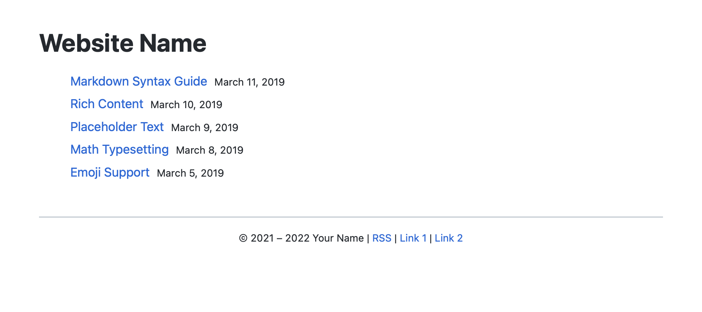
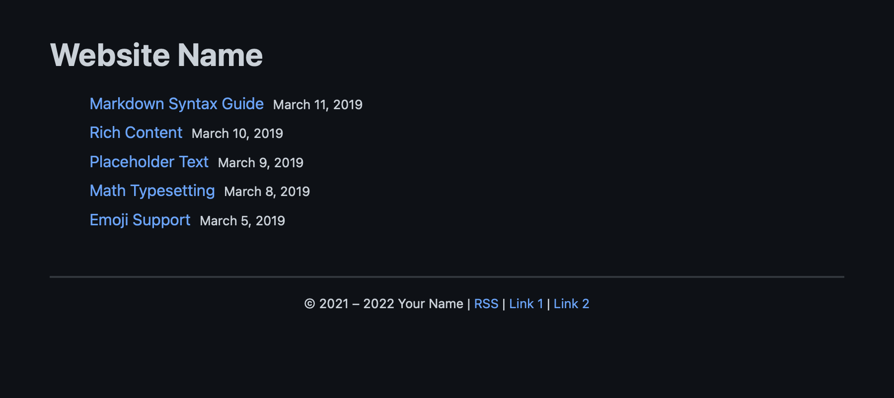

# svugo

**svugo** is a [Hugo](https://gohugo.io/) theme highly inspired by [XMin](https://github.com/yihui/hugo-xmin) and [Etch](https://github.com/LukasJoswiak/etch).

## Features

* Homepage with endless list of posts.
* Automatic Dark mode.
* [Multilingual mode](https://gohugo.io/content-management/multilingual/).
* [Chroma](https://gohugo.io/content-management/syntax-highlighting/) syntax highlighting.
* No external dependencies, no JavaScript, no web fonts.

## Installation

To install `svugo`, download the repository into the `themes` folder in the root of your site.

```bash
git submodule add https://github.com/SimoV15/svugo.git themes/svugo
```

Then, use the theme to generate your site.

```bash
hugo server -t svugo
```

## Screenshots

### Light mode



### Dark mode



## PageSpeed Insights scores


